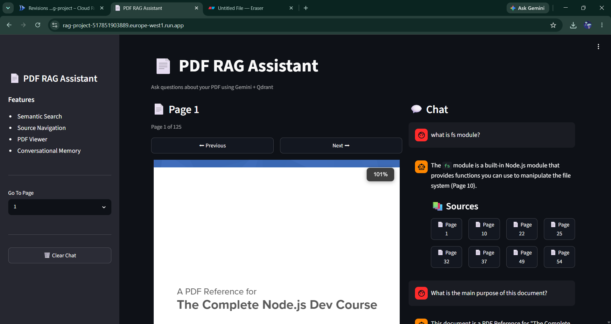
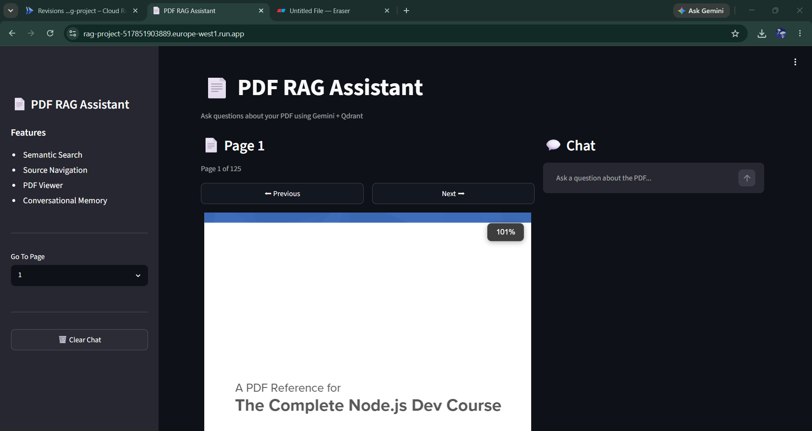
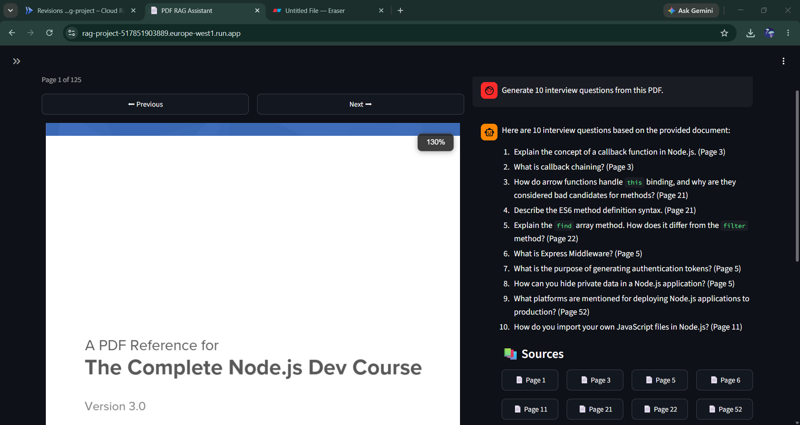

# PDF RAG Assistant

[Live Demo](https://rag-project-517851903889.europe-west1.run.app)

A production-ready Retrieval-Augmented Generation (RAG) application built using Gemini 2.5 Flash, Qdrant Cloud, LangChain, Streamlit, Docker, and Google Cloud Run.


## Overview

This project enables users to ask questions about PDF documents and receive grounded answers with source citations.

The system:

- Processes PDF documents
- Creates vector embeddings
- Stores embeddings in Qdrant Cloud
- Retrieves relevant chunks using semantic search
- Generates answers using Gemini 2.5 Flash
- Displays source page citations

## Features

- PDF document ingestion
- Recursive text chunking
- Gemini Embeddings
- Qdrant Cloud vector database
- MMR retrieval
- Source citations
- Streamlit UI
- Docker deployment
- Google Cloud Run hosting

## Architecture Diagram


## Tech Stack

| Component | Technology |
|------------|------------|
| Language | Python |
| Framework | LangChain |
| LLM | Gemini 2.5 Flash |
| Embeddings | Gemini Embedding 001 |
| Vector Database | Qdrant Cloud |
| Frontend | Streamlit |
| Containerization | Docker |
| Cloud | Google Cloud Run |

## Workflow

```text
PDF Document
      ↓
PyPDFLoader
      ↓
Text Chunking
      ↓
Gemini Embeddings
      ↓
Qdrant Cloud
      ↓
MMR Retrieval
      ↓
Relevant Context
      ↓
Gemini 2.5 Flash
      ↓
Answer + Page Citations
```

## Screenshots

### Home Page



### Chat Interface



### Source Citations



## Installation

```bash
git clone https://github.com/Nityanshi-Sharma-0103/pdf-rag-assistant.git

cd pdf-rag-assistant

pip install -r requirements.txt

streamlit run app.py
```

## Environment Variables

Create a `.env` file:

```env
GOOGLE_API_KEY=your_google_api_key

QDRANT_URL=your_qdrant_url

QDRANT_API_KEY=your_qdrant_api_key
```

## Future Improvements

- Multi-PDF support
- Conversation memory
- Hybrid Search
- Reranking
- Streaming responses
- Authentication
- PDF upload via UI

## Project Highlights

- End-to-end RAG implementation
- Gemini 2.5 Flash integration
- Qdrant Cloud vector retrieval
- Dockerized deployment
- Google Cloud Run hosting
- Source-grounded responses with page citations